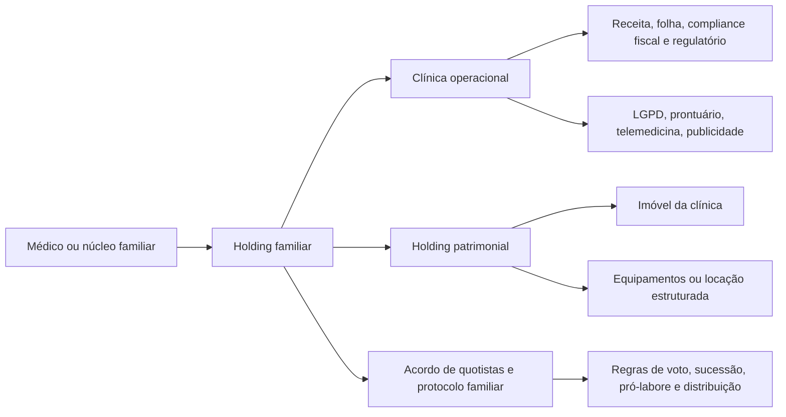
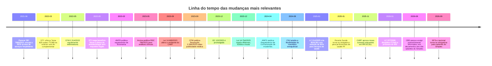

# Análise completa do ecossistema CARF e das fontes regulatórias relevantes para médicos e clínicas no Brasil

## Resumo executivo

Este relatório assume **Brasil** como jurisdição e foi estruturado para **médicos autônomos**, **microclínicas** e **clínicas de pequeno e médio porte**, com prioridade inicial para os sites do **Ministério da Fazenda** (`fazenda.gov.br`) e do **CARF** (`gov.br/carf`, com apoio do ambiente legado `carf.fazenda.gov.br`/Sincon). Esses dois ambientes concentram, hoje, o núcleo mais importante para acompanhar **contencioso tributário federal**, **reforma tributária do consumo**, **jurisprudência vinculante**, **súmulas**, **regimento**, **pautas de julgamento** e **notícias regulatórias de maior impacto fiscal**. citeturn24view0turn40search2turn40search3turn18search1turn18search6

Para médicos e clínicas, os temas que mais se destacam no recorte dos últimos cinco anos são estes: **benefício fiscal de “serviços hospitalares” no lucro presumido**, com forte dependência de enquadramento jurídico e documental; **digitalização do compliance do profissional pessoa física**, com obrigatoriedade do **Receita Saúde** desde 1º de janeiro de 2025; **intensificação do cruzamento eletrônico** entre recibos, DIRPF, DMED, retenções e faturamento; **reforma tributária do consumo**, com redução de **60% das alíquotas de IBS e CBS para serviços de saúde** na LC 214/2025, mas com 2026 já funcionando como ano de transição operacional; e **mudança estrutural no planejamento patrimonial e sucessório**, com a Lei 14.754/2023 e a LC 227/2026 alterando substancialmente o custo, a utilidade e o risco de estruturas com **offshores** e **trusts**. citeturn31view0turn26view0turn35view2turn17view0turn18search8turn18search7turn38search1turn38search10turn16search0turn16search5

No plano sucessório e patrimonial, a virada foi dupla. De um lado, o STF consolidou que estados e DF **não podiam cobrar ITCMD sobre heranças e doações vindas do exterior sem lei complementar federal**; de outro, a **EC 132/2023** e, depois, a **LC 227/2026** passaram a dar novo desenho constitucional e infraconstitucional ao ITCMD, inclusive com disciplina expressa para **trusts** e contratos assemelhados no exterior. Em paralelo, a Lei 14.754/2023 eliminou boa parte do antigo ganho de diferimento tributário em estruturas patrimoniais internacionais, ao passar a tributar rendimentos e lucros de certas estruturas estrangeiras em bases periódicas. citeturn15search0turn15search4turn16search0turn16search3turn38search1turn19search3turn19search4

Na governança regulatória, quatro frentes exigem monitoramento contínuo: **telemedicina e prontuário**, **publicidade médica**, **proteção de dados e incidentes de segurança**, e **contratualização/faturamento com operadoras e vigilância sanitária**. A Resolução CFM 2.314/2022 exige registro em prontuário e preservação dos dados nos serviços de telemedicina; a Resolução CFM 2.336/2023, em vigor desde 11 de março de 2024, reformulou profundamente a publicidade médica; a ANPD regulamentou dosimetria sancionatória e comunicação de incidente; a ANS reforça a obrigatoriedade de contratos escritos com operadoras e a disciplina do TISS; e a Anvisa vem atualizando regras para laboratórios, consultórios isolados que realizam análises clínicas e requisitos gerais de funcionamento e infraestrutura de serviços de saúde. citeturn43view0turn13search2turn35view0turn43view1turn34search5turn34search4turn32search12turn32search0turn39view0turn39view2

A conclusão prática é direta: **o risco central não está apenas em pagar mais tributo**, mas em **usar uma estrutura errada para a atividade certa**, **misturar patrimônio pessoal com o operacional**, **manter contratos e documentos fracos para um ambiente de fiscalização cada vez mais digital**, e **adiar a reorganização sucessória até um evento crítico**. Hoje, o médico ou a clínica que estiver bem posicionado juridicamente tende a combinar: enquadramento fiscal revisado, prova documental robusta, segregação patrimonial, acordo societário/familiar, política de pró-labore e distribuição de lucros, governança de dados e publicidade, e monitoramento sistemático do CARF, da Receita, da Anvisa, da ANS, da ANPD e do CFM. citeturn41view0turn36search1turn36search5turn24view0turn18search1turn34search2turn35view1

## Sites priorizados e mapa das fontes consultadas

Os dois pontos de partida mais importantes foram, como solicitado, o site do **Ministério da Fazenda** (`fazenda.gov.br`) e o site do **CARF** (`gov.br/carf`, com apoio do legado `carf.fazenda.gov.br`). O portal do CARF hoje expõe **Nova Pesquisa de Acórdãos – VER**, **acórdãos**, **súmulas por matéria**, **regimento interno**, **calendário de sessões**, **acompanhamento processual** e **dados abertos**; já o portal do Ministério da Fazenda centraliza **reforma tributária**, **notícias sobre o CARF**, **Q&As oficiais**, **offshores/trusts**, e materiais sobre a transição de IBS/CBS. citeturn24view0turn40search2turn40search3turn40search4turn40search6turn18search1turn18search6

A própria arquitetura do site do CARF mostra como o acompanhamento regulatório deve ser feito por advogados, contadores e gestores de clínicas: a camada de **jurisprudência** serve para entender linha decisória e precedentes; a camada de **súmulas** serve para monitorar consolidação de entendimento; a camada de **regimento** serve para entender rito, competência e mudanças procedimentais; e a camada de **pautas e sessões** serve para monitorar julgamentos relevantes antes da formação do precedente. Em 2023, o órgão destacou que a plataforma **VER** já havia ultrapassado meio milhão de documentos pesquisáveis, e o regimento hoje aparece no site já atualizado pelas Portarias posteriores à Portaria MF 1.634/2023. citeturn24view0turn40search4turn40search0turn40search3

No plano legislativo recente, os dois projetos mais relevantes para o setor foram o **PLP 68/2024**, que culminou na **LC 214/2025** sobre IBS/CBS/IS, e o **PLP 108/2024**, que culminou na **LC 227/2026**, com regras sobre CG-IBS, processo administrativo tributário do IBS e normas gerais do ITCMD. Para fins práticos, quem atua em clínicas precisa acompanhar menos o “projeto” e mais o **efeito operacional já convertido em lei**, porque a transição de 2026 já impacta documentos fiscais, parametrização de sistemas e opções de regime. citeturn16search14turn16search9turn16search2turn16search5turn18search12turn18search7

### Sites consultados

| Site consultado | Papel no relatório | Conteúdo utilizado |
|---|---|---|
| **Ministério da Fazenda** `fazenda.gov.br` | Fonte prioritária para reforma tributária, notícias sobre CARF, FAQs de offshores/trusts, guias da transição 2026 | Reforma tributária, offshores, normas do CARF, comunicados sobre IBS/CBS. citeturn18search1turn18search6turn19search5turn40search1 |
| **CARF** `gov.br/carf` | Fonte prioritária para acórdãos, súmulas, regimento, pautas, calendário, dados abertos | Estrutura do site, súmulas por matéria, acórdãos, RICARF, VER. citeturn24view0turn40search2turn40search3turn40search6 |
| **CARF legado / Sincon** `carf.fazenda.gov.br` | Banco legado e páginas específicas de acórdãos | Acórdão 2401-002.873 e pesquisa jurisprudencial. citeturn28search0turn41view0 |
| **Receita Federal** `gov.br/receitafederal` | Obrigações acessórias, jurisprudência vinculante, IRPF/IRPJ/CSLL, DMED, Receita Saúde, DCTFWeb | Receita Saúde, DMED, Livro Caixa, retenções, jurisprudência vinculante. citeturn29view0turn35view2turn33search12turn22view3turn22view2 |
| **eSocial** `gov.br/esocial` | Obligations trabalhistas/previdenciárias e eventos de folha | Atualizações de rubricas e integração com DCTFWeb. citeturn22view1 |
| **Planalto** `planalto.gov.br` | Texto legal primário consolidado | LGPD, LC 123, Lei 14.754, LC 214, LC 227, Lei 13.874. citeturn14search3turn21search1turn19search0turn21search10turn16search0turn36search1 |
| **STJ** `stj.jus.br` | Jurisprudência nacional relevante | Serviços hospitalares e decisão sobre clínica de anestesiologia. citeturn27view0turn20search2 |
| **STF** `stf.jus.br` | Jurisprudência constitucional | Tema 825 sobre ITCMD do exterior. citeturn15search0turn15search4 |
| **CFM** `portal.cfm.org.br` / `sistemas.cfm.org.br` / `publicidademedica.cfm.org.br` | Normas éticas e profissionais | Telemedicina, publicidade, prontuário, pareceres. citeturn43view0turn43view1turn43view2turn35view0turn35view1 |
| **ANS** `gov.br/ans` | Relação operadora-prestador, TISS, glosas, contratos | Contratos escritos, TISS, recurso de glosa. citeturn32search12turn32search15turn32search0 |
| **Anvisa** `gov.br/anvisa` | Vigilância sanitária, laboratórios, requisitos de funcionamento | RDC 786/2023, RDC 824/2023, RDC 63/2011, RDC 50/2002, licenciamento local. citeturn39view0turn39view1turn39view2 |
| **ANPD** `gov.br/anpd` | LGPD, sanções, incidente de segurança, encarregado | Res. 4/2023, Res. 15/2024, Res. 18/2024, Res. 11/2023, guias de segurança. citeturn34search2turn34search4turn34search5turn12search2 |
| **CNJ** `atos.cnj.jus.br` / `cnj.jus.br` | Inventário extrajudicial, notariado, consolidação normativa | Res. 571/2024, Res. 35/2007, Provimento 149/2023. citeturn37search9turn37search13turn37search4 |
| **Colégio Notarial / e-Notariado** `notariado.org.br` | Apoio prático a atos notariais eletrônicos | e-Notariado e atos digitais. citeturn37search2turn37search12 |
| **Câmara dos Deputados** `camara.leg.br` | Tramitação e texto legal de PLPs/LCs | PLP 68/2024, PLP 108/2024, LC 214, LC 227. citeturn16search2turn16search5turn16search9 |
| **Senado Federal** `senado.leg.br` / `senado.leg.br/noticias` | Tramitação e notícias legislativas | LC 227/2026 e material sobre reforma tributária. citeturn16search4turn16search6 |

## Tributário

### Resumo executivo da área

No tributário, o ponto mais sensível para clínicas médicas continua sendo a combinação entre **regime tributário**, **natureza efetiva da atividade**, **prova documental** e **compliance digital**. Para clínica que busca lucro presumido com base reduzida, o divisor de águas é o tema “**serviços hospitalares**”: a jurisprudência admite interpretação objetiva da atividade, mas, para fatos geradores a partir de 2009, a prestadora precisa estar **organizada como sociedade empresária** e **atender às normas da Anvisa**; além disso, **simples consultas médicas** não entram no benefício. Em paralelo, para médicos pessoa física, o **Receita Saúde** tornou obrigatório o recibo eletrônico desde 2025, elevando o poder de cruzamento da Receita sobre despesas médicas de pacientes e receita do profissional. citeturn31view0turn26view0turn27view0turn35view2

A tendência de 2025–2026 é de **fiscalização mais data-driven**. A Receita vem intensificando operações de autorregularização em Simples Nacional e comunicando transição educativa, mas já com forte pressão por ajuste de sistemas para IBS/CBS. Para clínicas, isso significa que o “erro tolerado” do passado — recibo manual, pró-labore mal calibrado, distribuição de lucros sem aderência contratual, retenção mal parametrizada, divergência entre faturamento e folha — está ficando estruturalmente mais arriscado. citeturn42search8turn42search14turn18search11turn18search12turn21search17

### Normas, decisões e mudanças que mais impactam médicos e clínicas

| Tema | Norma ou precedente | Impacto prático |
|---|---|---|
| Benefício de **serviços hospitalares** no IRPJ/CSLL | STJ Tema 217; RFB Jurisprudência Vinculante; **Parecer SEI 7689/2021/ME**; **Súmula CARF 142**. citeturn31view0turn26view0turn30view0 | O benefício exige separar atividades beneficiadas das não beneficiadas; **consultas simples ficam fora**; desde 01/01/2009, exige **sociedade empresária** e prova de atendimento às normas da **Anvisa**. citeturn31view0turn27view0 |
| Caso limite desfavorável | STJ, **REsp 1.877.568**, clínica de anestesiologia. citeturn27view0 | Mostra que a tese não protege automaticamente qualquer atividade médica especializada; sem os requisitos legais, o benefício é negado. citeturn27view0 |
| **Receita Saúde** obrigatório | Obrigatório para profissionais de saúde PF desde **01/01/2025**. citeturn35view2turn33search7 | Recibo em papel deixa de ser solução regular; o próprio recibo passa a alimentar o ambiente fiscal e a DIRPF do paciente. citeturn35view2turn33search5 |
| **DMED** | FAQ oficial da Receita. citeturn8search1turn33search12 | O médico individual, sem equiparação a PJ para esse fim, **não é equiparado à pessoa jurídica** para DMED; já clínicas/PJs prestadoras e operadoras entram na obrigação conforme a legislação própria. citeturn33search12turn8search1 |
| Retenção de IRRF em serviços médicos | MAFON / página de IRRF da Receita. citeturn22view3turn23view1 | A **simples prestação de serviço médico** gera retenção na fonte em casos previstos; retenção mal parametrizada produz saldo fiscal, glosas e risco de autuação. citeturn22view3turn23view1 |
| Médicos PF por intermediação de plano de saúde | Ato interpretativo e notícia oficial da Receita, 2025. citeturn22view0 | A operadora **não** recolhe a contribuição patronal em nome do médico/odontólogo PF; o profissional deve recolher a própria contribuição de 20%, respeitado o teto. citeturn22view0 |
| eSocial / DCTFWeb / compensações | eSocial e FAQ DCTFWeb. citeturn22view1turn22view2 | Clínicas precisam controlar folha, benefícios, retenções e créditos; o PER/DCOMP Web pode usar, em certas hipóteses, créditos de PIS/Cofins não cumulativos, saldo negativo de IRPJ e CSLL. citeturn22view2 |
| Reforma tributária do consumo | **LC 214/2025** e orientações 2026. citeturn17view0turn18search8turn18search7 | Serviços de saúde têm redução de **60%** em IBS/CBS; em 2026 há ano-teste com obrigações acessórias e adaptação de documentos fiscais. Glosas de auditoria médica não pagas não integram a base de cálculo dos serviços de saúde da LC 214. citeturn17view0 |
| Simples na transição do IBS/CBS | CGSN/Receita, 2026; NFS-e nacional obrigatória em 2026. citeturn18search3turn18search2turn42search11 | A clínica do Simples terá de reavaliar a conveniência de exercer ou não opção pelo regime regular de IBS/CBS; e a **NFS-e de padrão nacional** será obrigatória para optantes do Simples a partir de **1º de setembro de 2026**. citeturn18search3turn42search11 |

### Quadro comparativo de regimes e perfis mais comuns

| Estrutura | Quando costuma fazer sentido | Pontos fortes | Riscos e alertas imediatos |
|---|---|---|---|
| **Médico pessoa física** | Atuação individual, baixa complexidade societária, receita concentrada na pessoa natural. citeturn33search0turn35view2 | Pode deduzir despesas via **Livro Caixa** e apurar imposto via **Carnê-Leão**; desde 2025 usa **Receita Saúde** para recibos. citeturn33search0turn33search1turn35view2 | Cruzamento mais fácil com DIRPF do paciente; falha no Receita Saúde aumenta risco de malha; em serviços via operadora, há obrigação previdenciária própria. citeturn35view2turn22view0 |
| **Clínica no Simples Nacional** | Operação pequena ou média, com busca de simplicidade administrativa. citeturn21search1turn18search3 | Simplifica tributos correntes e terá, na reforma, possibilidade de avaliar regime regular de IBS/CBS sem abandonar os demais tributos do Simples. citeturn18search4turn18search3 | O enquadramento depende da atividade e da forma legal aplicável; em 2026 haverá adaptação operacional relevante, inclusive com **NFS-e nacional obrigatória** para optantes do Simples a partir de setembro. citeturn42search11turn18search3 |
| **Lucro presumido** | Clínica já societarizada, com margem operacional estável e estrutura fiscal mais madura. citeturn21search11turn31view0 | Na prestação de serviços em geral, é regime difundido; pode ser muito eficiente quando a clínica **não depende** do benefício de serviços hospitalares ou quando consegue cumpri-lo corretamente. citeturn21search11turn31view0 | O principal erro é presumir que “atividade médica” equivale a “serviço hospitalar”; isso **não** é automático. Consultas simples ficam fora, e o pós-2008 exige sociedade empresária + Anvisa. citeturn31view0turn27view0 |
| **Lucro real** | Operação com maior governança contábil, margens comprimidas, créditos e controles mais sofisticados. citeturn42search13turn22view2 | Permite tratamento mais aderente ao resultado efetivo e dialoga melhor com ambientes de compensação e créditos em estruturas complexas. citeturn22view2turn42search13 | Exige nível alto de escrituração, provisões, documentação e governança; para clínicas médias, tende a funcionar melhor quando já há controller, assessoria tributária e ERP maduros. Essa última observação é inferência operacional do conjunto normativo e do padrão de obrigações acessórias. citeturn22view2turn18search12 |

### Exemplos de jurisprudência e de risco concreto

O primeiro exemplo é o clássico tema de **serviços hospitalares**. A Receita e o CARF já vinculam sua atuação à interpretação de que o benefício fiscal não depende, em tese, de “internação”, mas da natureza da atividade; ao mesmo tempo, a própria RFB ressalva que, **para fatos geradores a partir de 2009**, a prestadora deve ser **sociedade empresária** e atender às **normas da Anvisa**, e o STJ confirmou, em 2022, a negativa do benefício para uma clínica de anestesiologia que não preencheu esses requisitos. citeturn31view0turn26view0turn27view0

O segundo exemplo vem do próprio CARF em matéria previdenciária e societária: o acórdão **2401-002.873** reconheceu incidência de contribuições sobre **pró-labore**, sobre **distribuição de lucros em desacordo com o contrato social**, sobre **despesas pessoais de sócios pagas pela empresa**, e sobre **cessão gratuita de imóvel ao sócio**, usando valores locatícios como base de cálculo em certos pontos. Para clínicas, o recado é inequívoco: improvisar contabilidade societária e patrimonial produz risco fiscal real, mesmo quando a intenção original era apenas “organizar caixa” ou “compensar sócio”. citeturn41view0

O terceiro exemplo é mais novo e importante para o contencioso tributário futuro: na página oficial de súmulas do CARF em IRPJ/CSLL, destacam-se a **Súmula 204**, aprovada em 2024, sobre a possibilidade de o Fisco confirmar requisitos de dedução de retenções e estimativas antes da homologação tácita da DCOMP, e a **Súmula 241**, aprovada em 2025, segundo a qual lançamento de **IRRF sobre pagamento sem causa ou a beneficiário não identificado** pode coexistir com lançamento de **IRPJ/CSLL por glosa de custos e despesas**. Isso é particularmente relevante para clínicas com documentação fraca de terceiros, repasses, cooperados, plantonistas e despesas assistenciais. citeturn26view0

### Medidas de compliance e planejamento recomendadas

A boa prática tributária para médicos e clínicas, hoje, é menos “achar o regime mais barato” e mais **manter coerência jurídica entre atividade, contrato social, CNAE, licenças, faturamento e prova documental**. Em especial: a clínica que pretende defender enquadramento como serviço hospitalar precisa ter memorial documental apto a provar **atividade elegível**, **natureza societária**, **atendimento sanitário**, e segregação entre receitas de consulta simples e receitas possivelmente beneficiadas. Já o médico PF deve tratar **Receita Saúde, Carnê-Leão, Livro Caixa e contribuição previdenciária** como um único ecossistema de conformidade, e não como obrigações isoladas. citeturn31view0turn35view2turn33search0turn22view0

Para micro e pequenas clínicas, a decisão entre Simples e lucro presumido não deveria ser tomada sem uma matriz mínima com: receita anual, folha, dependência de operadoras, margem operacional, volume de consultas próprias versus procedimentos, retenções na fonte, equipamentos, locação e expansão prevista. Já para clínicas médias, a prioridade é parametrizar **notas fiscais**, **retenções**, **folha**, **DCTFWeb**, **PER/DCOMP**, e revisar desde já a aderência do ERP à transição de **IBS/CBS** em 2026. citeturn18search12turn18search7turn22view2turn42search11

### Checklist imediato da área tributária

- [ ] Revisar o **regime atual** e comparar com cenário alternativo em planilha simples: PF, Simples, presumido, real.  
- [ ] Se houver tese de **serviço hospitalar**, montar dossiê com contrato social, provas de atividade, alvará/licença sanitária e mapeamento de receitas elegíveis e não elegíveis.  
- [ ] Para médico PF, validar rotina de **Receita Saúde**, **Carnê-Leão** e **Livro Caixa**.  
- [ ] Confirmar se a operação está ou não obrigada à **DMED**.  
- [ ] Revisar retenções de **IRRF**, previdência e parametrização de **DCTFWeb/PERDCOMP**.  
- [ ] Iniciar projeto de adaptação de documentos fiscais para **2026** e, se no Simples, preparar a migração para a **NFS-e nacional**.  
- [ ] Auditar a política de **pró-labore** e a aderência da **distribuição de lucros** ao contrato social.  

## Sucessório

### Resumo executivo da área

Na sucessão, o período 2021–2026 mudou mais do que muitos médicos percebem. O marco inicial foi o **Tema 825 do STF**, que afastou a possibilidade de estados e DF cobrarem ITCMD sobre heranças e doações do exterior sem lei complementar federal. Depois, a **EC 132/2023** reconfigurou a tributação patrimonial e, por fim, a **LC 227/2026** passou a instituir **normas gerais do ITCMD**, inclusive disciplinando a mudança de titularidade de bens e direitos sob **trust** como transmissão causa mortis ou doação, conforme o evento. Isso significa que o planejamento sucessório internacional ficou, ao mesmo tempo, **mais regulado** e **menos opaco**. citeturn15search0turn15search4turn16search0turn16search3turn16search5

Para médicos e famílias médicas, a consequência prática é que a sucessão não deve mais ser pensada apenas como uma combinação de “testamento + holding” ou “offshore + trust”, mas como uma **arquitetura integrada** entre governança familiar, disponibilidade de herdeiros para a operação, controle societário da clínica, liquidez para ITCMD e continuidade do atendimento. O risco hoje não é só tributário; é também **operacional**: sem desenho sucessório, uma clínica pode entrar em paralisia decisória no momento mais delicado. Essa parte operacional é uma inferência empresarial do novo quadro normativo, especialmente relevante para clínicas cuja imagem e faturamento dependem do sócio fundador. citeturn16search0turn37search9turn37search13

### Principais normas e decisões

| Tema | Marco normativo ou jurisprudencial | Efeito para médicos e clínicas |
|---|---|---|
| ITCMD em bens e heranças do exterior | STF, **Tema 825**. citeturn15search0turn15search4 | O STF afastou a cobrança estadual sem lei complementar federal, o que mudou profundamente o planejamento sucessório internacional até a edição da LC 227/2026. citeturn15search0turn15search4 |
| Nova moldura constitucional | **EC 132/2023** e regulamentação posterior. citeturn16search9turn18search1 | Inseriu o redesenho do sistema e abriu espaço para a nova disciplina do ITCMD. citeturn16search9turn16search5 |
| Normas gerais do ITCMD | **LC 227/2026**. citeturn16search0turn16search5 | Traz disciplina nacional sobre ITCMD e incorpora regras específicas para situações com trust e contratos semelhantes no exterior. citeturn16search0turn16search3 |
| Trusts e exterior | **Lei 14.754/2023** e regulamentação por FAQ/IN. citeturn38search1turn19search4 | O trust passou a ter definição legal no Brasil para fins tributários, e estruturas no exterior perderam parte relevante do benefício de diferimento. citeturn38search1turn38search9turn38search10 |
| Inventário extrajudicial | **Resolução CNJ 571/2024** e **Resolução CNJ 35/2007**. citeturn37search9turn37search13 | Reforça a utilidade do extrajudicial, inclusive com livre escolha de tabelião, mas mantém a necessidade de recolhimento prévio dos tributos incidentes. citeturn37search9turn37search13 |
| Atos digitais | e-Notariado / Provimento 149/2023. citeturn37search2turn37search4 | A execução documental do planejamento sucessório ficou mais ágil, inclusive para procurações e escrituras digitais, sem substituir a necessidade de desenho jurídico adequado. citeturn37search2turn37search4 |

### Estruturas sucessórias e seus usos comparados

| Estrutura | Quando funciona melhor | Vantagem principal | Ponto de atenção |
|---|---|---|---|
| **Doação de quotas com reserva de usufruto** | Famílias que querem antecipar transição controlando voto e frutos. | Ajuda a reduzir o inventário operacional e pode organizar sucessão da clínica em vida. | Exige calibragem de ITCMD, governança e regras de administração; não resolve, sozinho, conflitos entre herdeiros. A necessidade de encaixar a solução ao ITCMD estatal decorre da competência estadual disciplinada nas normas gerais atuais. citeturn16search5turn37search13 |
| **Testamento + acordo societário/protocolo familiar** | Quando o fundador quer preservar flexibilidade e regras de comando. | É a combinação mais útil quando alguns herdeiros participarão da clínica e outros não. | Sem política de liquidez, valuation e regras de saída, o conflito só muda de lugar. Essa é inferência prática a partir do regime sucessório e societário atual. citeturn37search13turn37search9 |
| **Holding familiar** | Quando há clínica, imóveis, aplicações e herdeiros com perfis diferentes. | Facilita centralização de governança, quotas, voto, distribuição e sucessão. | Sem disciplina robusta de caixa, alçadas e confusão patrimonial, a holding vira apenas “embrulho societário”. O risco de confusão patrimonial é juridicamente relevante. citeturn36search1turn36search5 |
| **Offshore / trust** | Apenas para patrimônios já internacionalizados ou com conexão real com o exterior. | Pode continuar tendo utilidade civil, de governança ou de jurisdição, em casos específicos. | Perdeu relevância como instrumento simples de diferimento; hoje exige revalidação frente à **Lei 14.754/2023** e à **LC 227/2026**. citeturn38search1turn38search10turn16search0turn16search3 |

### Exemplos e efeitos práticos

O exemplo mais importante é o das famílias que vinham tratando **trust** ou **offshore** como solução quase automática de sucessão e proteção patrimonial. Isso ficou muito mais caro em termos de manutenção fiscal e evidência documental: a Lei 14.754/2023 passou a disciplinar trusts e a tributar rendimentos e lucros com alíquota de 15% em vários cenários; a LC 227/2026, por sua vez, criou regra expressa de ITCMD para mudança de titularidade em trust. O efeito combinado é que essas estruturas agora precisam ser defendidas por sua **função civil e societária real**, e não por uma expectativa genérica de diferimento tributário. citeturn38search1turn19search3turn19search4turn38search10turn16search0turn16search3

No plano doméstico, a novidade relevante foi o reforço do **extrajudicial** como via de eficiência, inclusive com liberdade de escolha do tabelião nos atos de inventário e partilha consensuais. Para famílias médicas, isso melhora a velocidade de implementação de soluções de sucessão patrimonial, mas não substitui o trabalho prévio de levantar tributos, inventariar ativos, revisar contratos sociais e decidir quem herdará participação operativa e quem herdará apenas valor econômico. citeturn37search9turn37search13

### Medidas de compliance e planejamento recomendadas

O planejamento sucessório recomendado para médicos e clínicas deve partir de quatro perguntas: **quem comanda a clínica se o fundador faltar**, **quem pode votar**, **quem pode receber renda**, e **como se paga o ITCMD sem estrangular o caixa da operação**. Em famílias com patrimônio já diversificado, a solução costuma exigir documento societário, protocolo familiar, testamento e, em alguns casos, holding com segregação clara entre controle e fruição econômica. Nos casos com ativos no exterior, a revisão deve ser imediata por causa da combinação **Lei 14.754/2023 + LC 227/2026**. citeturn38search1turn38search10turn16search0turn16search5

### Checklist imediato da área sucessória

- [ ] Mapear os ativos em quatro cestos: **clínica operacional**, **imóveis**, **aplicações**, **ativos no exterior**.  
- [ ] Identificar quem são os herdeiros com vocação para **gestão**, **voto** e **renda**.  
- [ ] Revisar contrato social para sucessão de quotas, ingresso de herdeiros e regras de administração.  
- [ ] Calcular cenários de **ITCMD** e a fonte de liquidez para seu pagamento.  
- [ ] Se houver ativo internacional, revisar imediatamente a aderência à **Lei 14.754/2023** e à **LC 227/2026**.  
- [ ] Avaliar combinação entre **testamento**, **doação de quotas**, **protocolo familiar** e, se fizer sentido, **holding**.  
- [ ] Preparar rota documental para eventual **inventário extrajudicial**.  

## Patrimonial

### Resumo executivo da área

Na proteção patrimonial, a principal fronteira entre planejamento lícito e risco grave é a **segregação real de riscos**. A Lei da Liberdade Econômica reforçou que a **autonomia patrimonial das pessoas jurídicas é um instrumento lícito de alocação e segregação de riscos**; mas esse mesmo sistema jurídico permite a desconsideração da personalidade jurídica em caso de **abuso**, caracterizado por **desvio de finalidade** ou **confusão patrimonial**. Em outras palavras: holding patrimonial e separação entre imóvel e operação fazem sentido; o que não faz sentido é usar pessoa jurídica sem disciplina documental, sem fronteiras econômicas e como extensão do bolso pessoal do sócio. citeturn36search1turn36search5

O CARF ajuda a enxergar esse problema com concretude. No acórdão 2401-002.873, a Corte administrativa tratou como geradores de contribuição situações como **pró-labore**, **lucros distribuídos fora do contrato**, **despesas pessoais de sócios pagas pela empresa**, **cessão gratuita de imóvel ao sócio** e **assistência médico-odontológica sem extensão a todos os empregados/diretores**. Para clínicas, esse conjunto costuma aparecer quando a sociedade cresce rápido, mas a governança continua doméstica. citeturn41view0

### Estrutura patrimonial recomendável

A estrutura abaixo é **ilustrativa** e atende melhor ao objetivo de **separar risco assistencial-operacional** do **patrimônio familiar e imobiliário**, desde que seja implementada com contratos, aluguel/cessão a valor de mercado, política de distribuição e ausência de confusão patrimonial. Essa lógica é compatível com a autonomia patrimonial reconhecida em lei, mas perde proteção quando a sociedade é usada com desvio de finalidade ou mistura patrimonial. citeturn36search1turn36search5turn41view0

### Matriz de riscos patrimoniais

| Risco | Como normalmente surge | Efeito prático | Base de alerta |
|---|---|---|---|
| **Confusão patrimonial** | Pagamento de despesa pessoal do sócio pela clínica; caixa único; uso indistinto de bens. | Perda de segurança patrimonial, risco fiscal e eventual desconsideração. | Lei 13.874/2019 e art. 50 do CC. citeturn36search1turn36search5 |
| **Imóvel no mesmo CNPJ da operação** | Clínica compra ou mantém o imóvel operacional na mesma sociedade que assume risco assistencial e trabalhista. | Exposição conjunta do ativo imobiliário a passivos da operação. | Racional da segregação patrimonial reconhecido em lei. citeturn36search1 |
| **Lucros distribuídos sem aderência societária** | Repasses informais entre sócios, sem contrato, sem critério, sem documentação. | Reclassificação previdenciária e tributária. | Acórdão CARF 2401-002.873. citeturn41view0 |
| **Cessão de imóvel e vantagens a sócios sem critério de mercado** | Uso gratuito ou subavaliado de imóvel da PJ, ou pagamento de despesas privadas. | Incidência de contribuições e aumento de exposição patrimonial. | Acórdão CARF 2401-002.873. citeturn41view0 |
| **Estruturas internacionais desatualizadas** | Offshore/trust mantidos com desenho anterior a 2024–2026. | Custo fiscal e sucessório maior, risco declaratório e de estratégia inadequada. | Lei 14.754/2023 e LC 227/2026. citeturn38search1turn38search10turn16search0 |

### Exemplos de casos e jurisprudência

O exemplo mais didático é justamente o acórdão do CARF sobre despesas e vantagens a sócios. Ele serve como “manual do que não fazer” em clínica familiar: pagar aluguel de moradia do sócio pela PJ, distribuir lucros fora do contrato, tratar vantagem patrimonial privada como se fosse despesa operacional, ou ceder imóvel sem critério econômico robusto. Nada disso é apenas um risco contábil; é um risco **patrimonial com efeito tributário**. citeturn41view0

O exemplo estrutural vem do próprio Código Civil, após a reforma da Lei da Liberdade Econômica: a autonomia patrimonial pode e deve ser usada para **segregar risco**, mas perde eficácia quando há **desvio de finalidade** ou **confusão patrimonial**. Por isso, “holding patrimonial” não é solução mágica; ela só funciona juridicamente quando a separação é verdadeira, continuada e documentada. citeturn36search1turn36search5

### Medidas de compliance e planejamento recomendadas

Na prática, médicos e clínicas deveriam tratar **proteção patrimonial** como um projeto de governança, e não como um ato de cartório isolado. Isso implica: separar operação e imóveis quando economicamente justificável; formalizar contratos entre partes relacionadas; atribuir pró-labore e distribuição conforme contrato e documentação; impedir que a clínica arque com despesas privadas; e revisar anualmente a coerência entre societário, contabilidade, tributário e sucessão. Esses passos são a resposta empresarial mais consistente aos riscos identificados pelas normas e pela jurisprudência. citeturn36search1turn36search5turn41view0

### Checklist imediato da área patrimonial

- [ ] Separar em mapa visual o que é **ativo operacional**, **ativo imobiliário**, **ativo financeiro** e **ativo pessoal**.  
- [ ] Revisar se a clínica paga qualquer despesa que, na essência, seja do sócio ou da família.  
- [ ] Formalizar contratos entre partes relacionadas com valor e racional econômico defensáveis.  
- [ ] Revisar contrato social para política de **pró-labore**, **lucros**, **alçadas** e **saída de sócios**.  
- [ ] Avaliar se o imóvel da clínica deve ou não permanecer no mesmo veículo societário da operação.  
- [ ] Se houver estrutura internacional, revalidar estratégia após Lei 14.754/2023 e LC 227/2026.  

## Governança e regulatório setorial

### Resumo executivo da área

Em governança, clínicas e médicos estão submetidos a um arranjo regulatório multifonte: **CFM/CRM**, **ANPD/LGPD**, **Anvisa**, **ANS**, **Receita** e, quando há equipe, **eSocial/DCTFWeb**. O problema típico não é desconhecer uma regra isolada, mas permitir que os departamentos jurídico, marketing, faturamento, TI e assistencial operem com “verdades” diferentes. Hoje, esse desalinhamento aparece, por exemplo, quando a clínica faz publicidade permitida pelo CFM, mas sem processar adequadamente a base legal e a segurança do dado sensível; ou quando tem contrato com operadora, mas um faturamento TISS fraco e sem governança de glosa; ou quando atende por telemedicina com boa intenção clínica, porém sem governança de prontuário e rastreabilidade. citeturn43view0turn43view1turn34search4turn32search0turn32search12turn39view2

### Principais frentes regulatórias

| Frente | Norma / fonte | Impacto prático para clínicas e médicos |
|---|---|---|
| **Telemedicina** | Resolução CFM **2.314/2022**. citeturn43view0turn13search2 | O atendimento telemédico deve ser registrado em prontuário e os dados/imagens devem ser preservados com integridade, confidencialidade e sigilo. citeturn13search2turn13search10 |
| **Prontuário eletrônico** | Resolução CFM **1.821/2007**, modificada em 2018, e Lei 13.787/2018. citeturn43view2turn14search1 | O uso de sistemas informatizados é admitido, com requisitos de segurança; prontuários eletrônicos arquivados adequadamente têm guarda permanente, e o papel não digitalizado tem prazo mínimo de 20 anos. citeturn43view2 |
| **Publicidade médica** | Resolução CFM **2.336/2023**, em vigor desde **11/03/2024**. citeturn35view0turn43view1 | Regras novas para redes sociais, identificação de CRM/RQE, publicidade de preços, descontos e tecnologias, e requisitos específicos para hospitais e clínicas. citeturn35view0turn35view1 |
| **LGPD e dados sensíveis** | LGPD; Res. ANPD 4/2023, 11/2023, 15/2024, 18/2024; guias e checklists. citeturn14search3turn34search2turn34search4turn34search5turn12search2turn12search3 | Saúde é categoria de dado especialmente sensível; incidentes relevantes devem ser comunicados em **3 dias úteis**; já há quadro sancionatório e orientação específica para agentes de pequeno porte. citeturn34search4turn34search5turn34search2 |
| **Contrato com operadoras** | ANS: contrato escrito obrigatório e penalidades pela ausência. citeturn32search12turn32search15 | Clínicas, hospitais, laboratórios e profissionais credenciados devem ter contrato escrito com operadoras, sob pena de sanções regulatórias. citeturn32search12turn32search15 |
| **TISS e glosas** | Padrão TISS da ANS. citeturn32search0turn32search13 | O processo formal de **recurso de glosa** é parte do fluxo regulatório; faturamento sem rastreabilidade gera erosão financeira e disputa frequente. citeturn32search0 |
| **Licenciamento e boas práticas sanitárias** | Anvisa: RDC 786/2023, RDC 824/2023, RDC 63/2011, RDC 50/2002, nota técnica 2024. citeturn39view0turn39view1turn39view2 | Laboratórios e consultórios que realizem análises clínicas devem rever enquadramento; serviços de saúde em geral precisam de licença local, boas práticas e infraestrutura compatível. citeturn39view0turn39view1turn39view2 |

### O que mudou na publicidade médica e por que isso importa

A Resolução CFM 2.336/2023 não apenas “afrouxou” ou “endureceu” publicidade; ela **reorganizou a lógica do marketing médico**. O CFM passou a diferenciar com maior precisão **publicidade** e **propaganda**, exigir CRM e RQE na página principal dos perfis em que haja divulgação, permitir a informação de **valores de consulta** e **formas de pagamento** em certas hipóteses, admitir **descontos em campanhas promocionais** com limitações, e impor identificação visível do estabelecimento e do diretor técnico-médico em peças publicitárias de hospitais e clínicas. Para clínicas, isso significa que marketing, jurídico e direção técnica precisam atuar sob o mesmo manual. citeturn35view0turn43view1

### O que mudou na proteção de dados e por que isso importa

A mudança mais prática no eixo LGPD foi a formação de um ambiente menos abstrato e mais exigível. A ANPD editou o regulamento de **dosimetria e sanções administrativas** em 2023, aprovou o **regulamento de incidentes de segurança** em 2024 e fixou, em sua página oficial, o prazo de **3 dias úteis** para comunicação de incidente à ANPD e aos titulares, quando houver risco ou dano relevante. Também há regulamento específico para **pequeno porte** e materiais de segurança da informação voltados a agentes desse perfil. Para clínicas menores, isso não elimina obrigação; apenas muda a forma de escaloná-la. citeturn34search5turn34search4turn34search2turn12search2

### O que mudou na Anvisa e ANS e por que isso importa

Para clínicas com laboratório, coleta ou análises clínicas, a **RDC 786/2023** substituiu a antiga RDC 302/2005 e passou a alcançar também certos **consultórios isolados** e outros estabelecimentos que desenvolvem atividades relacionadas a exames. A **RDC 824/2023** fez ajustes pontuais na fase de implantação. Em paralelo, a nota técnica da Anvisa sobre serviços de saúde relembra que normas gerais como **RDC 63/2011** e **RDC 50/2002** seguem aplicáveis, e que a regularização sanitária depende da vigilância local. Na saúde suplementar, a ANS exige **contrato escrito** entre operadora e prestador e estrutura o **recurso de glosa** no TISS; isso afeta diretamente fluxo de caixa e governança de faturamento. citeturn39view0turn39view1turn39view2turn32search12turn32search0

### Medidas de compliance e planejamento recomendadas

A governança mínima de uma clínica em 2026 deveria incluir, pelo menos, cinco políticas: **prontuário e telemedicina**, **publicidade médica**, **LGPD e resposta a incidentes**, **faturamento/contratos com operadoras**, e **licenças e conformidade sanitária**. Em termos práticos, isso equivale a ter matriz de responsabilidade clara entre diretor técnico, jurídico, encarregado/DPO, marketing, TI e faturamento. A norma relevante deixou de ser “só jurídica”; ela virou norma de processo. citeturn43view0turn35view0turn34search4turn32search12turn39view2

### Checklist imediato da área de governança

- [ ] Criar ou revisar **política de prontuário** para telemedicina e atendimento presencial.  
- [ ] Revisar redes sociais, site e materiais comerciais à luz da **Resolução CFM 2.336/2023**.  
- [ ] Nomear responsável interno por **LGPD** e testar fluxo de resposta a incidente em até **3 dias úteis**.  
- [ ] Revisar contratos com operadoras e a trilha de **recurso de glosa** no TISS.  
- [ ] Conferir licenças sanitárias, POPs, protocolos e aderência das unidades às normas da Anvisa e da vigilância local.  
- [ ] Revisar adequação do sistema de prontuário eletrônico aos requisitos de segurança e guarda.  

## Timeline e modelo de implementação

Os marcos abaixo condensam as mudanças que mais alteraram o desenho jurídico e regulatório para médicos e clínicas. O ponto central é que **2021–2024** foi um período de consolidação jurisprudencial e regulatória; **2025–2026** é o momento em que essas mudanças se tornam operacionais, especialmente por causa da transição da reforma tributária, da obrigatoriedade do Receita Saúde e das novas regras de ITCMD/trusts. citeturn31view0turn35view2turn17view0turn16search0turn34search4turn35view0

### Cronograma de implementação sugerido

| Janela | Ação prioritária | Responsável típico | Evidência de conclusão |
|---|---|---|---|
| **Primeiros 30 dias** | Revisão de regime tributário, pró-labore, distribuição de lucros, DMED/Receita Saúde e contratos com operadoras | Sócios + contador + jurídico | Memorando tributário; política de pró-labore; mapa de obrigações |
| **30 a 60 dias** | Dossiê de serviços hospitalares, revisão de redes sociais/publicidade, inventário patrimonial e sucessório | Jurídico + marketing + diretoria técnica | Dossiê documental; checklist CFM; mapa de ativos e herdeiros |
| **60 a 90 dias** | Implementar política LGPD/incidentes, revisar prontuário/telemedicina, parametrizar DCTFWeb e notas fiscais | TI + DPO/encarregado + fiscal | Plano de resposta a incidente; POP de prontuário; testes de sistema |
| **90 a 180 dias** | Preparar transição IBS/CBS 2026, NFS-e nacional no Simples, eventuais reorganizações societárias/patrimoniais | Fiscal + contábil + jurídico societário | Roadmap de ERP/documentos; alteração contratual; cronograma de implantação |
| **Até o fim de 2026** | Revalidar estrutura internacional, holding, sucessão e governança familiar | Sócios + jurídico patrimonial/sucessório | Parecer de revalidação da estrutura e plano formal de sucessão |

### Modelo consolidado de checklist para implementação

| Tema | Pergunta de controle | Situação | Evidência mínima |
|---|---|---|---|
| Tributário | O regime tributário e a natureza da atividade estão coerentes? | ☐ | Memorando fiscal e comparação entre regimes |
| Tributário | Há política escrita de pró-labore e lucros aderente ao contrato social? | ☐ | Contrato + deliberação societária |
| Tributário | Receita Saúde / DMED / retenções / DCTFWeb estão conciliados? | ☐ | Conciliação mensal |
| Sucessório | Existe regra de comando e voto para ausência, incapacidade ou falecimento do sócio-chave? | ☐ | Protocolo familiar / acordo de quotistas |
| Sucessório | O ITCMD e a liquidez para pagá-lo foram estimados? | ☐ | Simulação patrimonial |
| Patrimonial | Operação, imóveis e ativos pessoais estão segregados? | ☐ | Organograma patrimonial e contratos |
| Patrimonial | Há despesas privadas ou vantagens a sócios passando pelo CNPJ operacional? | ☐ | Auditoria de contas e centros de custo |
| Governança | Publicidade e redes sociais estão conformes ao CFM? | ☐ | Checklist de peças e perfis |
| Governança | Existe plano de incidente LGPD com prazo de 3 dias úteis? | ☐ | Política e teste de mesa |
| Governança | Há contrato escrito com operadoras e trilha de glosa/TISS? | ☐ | Contratos e relatórios de glosa |
| Governança | Licenças sanitárias, POPs e prontuário eletrônico estão atualizados? | ☐ | Pasta regulatória e relatório de conformidade |

## Limitações e questões em aberto

Este relatório priorizou **fontes primárias nacionais e federais**. Dois pontos dependem de validação local e caso a caso. Primeiro, **ISS** continua sendo tributo municipal e a prática operacional de NFS-e, retenções e fiscalização pode variar por município, embora a transição para IBS/CBS já esteja em curso no plano federal. Segundo, **ITCMD** permanece com disciplina estadual relevante, ainda que agora subordinada às normas gerais da **LC 227/2026**; portanto, alíquota, procedimentos, obrigações acessórias e prática fiscal local precisam ser avaliados por estado. citeturn21search3turn16search5

Também há uma limitação material importante: a utilidade de estruturas como **holding familiar**, **doação com usufruto**, **trust** ou **offshore** depende de fatos muito concretos — composição familiar, residência fiscal, participação de herdeiros na operação, caixa disponível para ITCMD e natureza dos ativos. Por isso, use este relatório como **mapa de decisão e de risco**, não como substituto de desenho jurídico individualizado. citeturn38search1turn16search0turn36search1