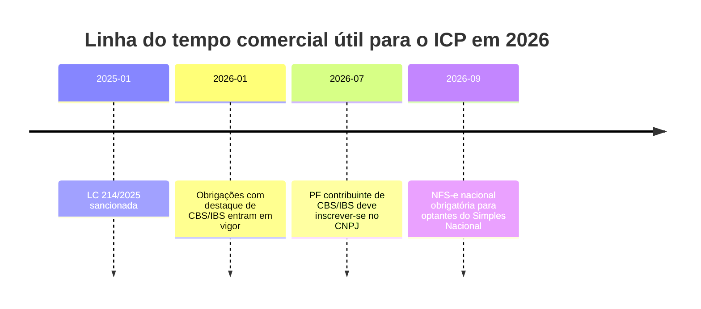
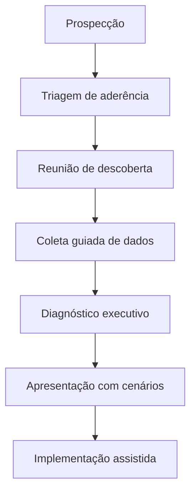

# Pesquisa analítica do ICP de médicos e clínicas

## Sumário executivo

O ICP anexado aponta para um alvo comercial centrado em **médicos, consultórios, clínicas e estruturas médicas com dor relevante em tributação, compliance, organização societária/patrimonial e segurança jurídica**, com prestação consultiva de alcance nacional e forte dependência de argumentação técnica para vencer objeções. Em termos de vendabilidade, a melhor tese comercial **não é “prometer economia tributária”**, mas sim **vender clareza de risco, governança documental, priorização de oportunidades e cenários defensáveis de decisão**. Isso é especialmente verdadeiro porque o ambiente regulatório e operacional do setor ficou mais exigente: a Receita Federal reforça a obrigação de informação sobre serviços médicos via Dmed; a reforma do consumo entrou em fase operacional em 2026; a NFS-e nacional passa a ser obrigatória para optantes do Simples Nacional a partir de setembro de 2026; clínicas que operam com convênios estão submetidas a TISS, QUALISS e crescente pressão por indicadores e modelos de remuneração baseados em valor; e todos os agentes de tratamento estão sujeitos à fiscalização da ANPD. fileciteturn0file0 citeturn20view3turn25view2turn46view1turn41view0turn41view6turn48view3turn37view1turn37view2

A oportunidade comercial mais forte está em transformar esse cenário em uma oferta de **diagnóstico executivo** com quatro promessas objetivas: **mapear exposição**, **quantificar oportunidades por cenário**, **organizar a base documental**, e **definir um plano de implementação com quick wins e prioridades estruturais**. O comprador tende a responder melhor quando a conversa começa por: “o que está vulnerável”, “o que está desorganizado”, “o que mudou em 2026” e “quanto custa continuar sem visibilidade”, em vez de começar por tese jurídica abstrata. Essa abordagem conversa melhor com médicos-sócios, gestores administrativos-financeiros e famílias empresárias do que uma abordagem puramente técnico-tributária. A conclusão prática é que o diagnóstico comercial vendável deve ser posicionado como **camada especializada acima da contabilidade operacional**, e não como substituto simples do contador. fileciteturn0file0 citeturn20view3turn46view1turn37view1turn37view2

**Nível de confiança geral do relatório:** **alto** para contexto regulatório e estrutura de dores operacionais; **médio** para priorização comercial por segmento/cargo; **médio para baixo** para qualquer tese jurisprudencial específica mencionada no ICP que não foi possível revalidar exaustivamente em inteiro teor nesta sessão. As referências jurisprudenciais citadas no anexo devem ser tratadas como **premissas do ICP** até validação jurídica final. fileciteturn0file0

## Leitura do ICP anexado e lacunas críticas

Pelo anexo, o recorte não é “saúde” de forma ampla, mas sim **médicos e estruturas médicas com sensibilidade a planejamento tributário, patrimonial e societário**, incluindo contextos em que o decisor é o próprio médico-sócio e outros em que há um braço administrativo-financeiro influenciando a compra. O arquivo também sugere uma venda baseada em diagnóstico e consultoria aplicada, não em software nem em operação transacional pura. fileciteturn0file0

Mesmo com o ICP anexado, ainda faltam variáveis decisivas para aumentar a assertividade da prospecção, do roteiro de descoberta e da oferta. Sem essas variáveis, o risco comercial é cair numa mensagem genérica demais para realidades que, no setor médico, são muito diferentes entre si: consultório particular, clínica de especialidade, centro médico com convênio, sociedade médica pulverizada e holding familiar têm dores e critérios de decisão distintos. O próprio CFM disponibiliza painéis que mostram como a segmentação por especialidade, município, estado, generalista/especialista e perfil local altera o desenho do mercado médico. fileciteturn0file0 citeturn5view2

| O que o ICP já define | O que ainda precisa ser especificado para refinar o diagnóstico |
|---|---|
| Público-base: médicos, consultórios, clínicas e grupos médicos com dor tributária/compliance. fileciteturn0file0 | **Especialidade prioritária**: dermatologia, oftalmo, ortopedia, imagem, cardio, fertilidade, multiespecialidade etc. Sem isso, a dor e o ticket variam demais. |
| Oferta-base: diagnóstico consultivo com viés comercial e técnico. fileciteturn0file0 | **Mix de receita**: particular, reembolso, convênios, hospitais, PJ contratante, SUS. Isso redefine risco fiscal e mensagem comercial. citeturn20view3turn41view0 |
| Decisão orientada por segurança jurídica, exposição e ganho financeiro. fileciteturn0file0 | **Regime atual e arquitetura societária**: PF, PJ, Simples, Lucro Presumido, múltiplos CNPJs, SCP, holding, distribuição, pró-labore. citeturn20view3turn46view1turn25view2 |
| Escopo nacional e entrega consultiva/digital. fileciteturn0file0 | **Município/estado prioritário**: ISS, perfil do mercado e densidade médica mudam a força da tese de venda. O CFM oferece painéis por município e estado. citeturn5view2 |
| Sensibilidade a compliance, documentação e organização. fileciteturn0file0 | **Maturidade digital**: software atual, prontuário, NFS-e, TISS, BI, contas a receber, LGPD, incidentes, processos. citeturn41view0turn46view1turn37view1turn37view2 |
| Foco em diagnóstico “vendável”. fileciteturn0file0 | **Porte e faturamento**: consultório solo, clínica com recepção enxuta, centro médico, rede. Isso altera objeções, urgência e pricing da oferta. |

**Checklist mínimo de dados do ICP para a próxima iteração**

1. Especialidades prioritárias e ticket médio por especialidade.  
2. Receita anual e faixas de margem por operação.  
3. Percentual da receita vindo de PF, convênios, hospitais e PJ contratantes.  
4. Regime tributário atual e regimes anteriores dos últimos 3 anos.  
5. Número de sócios, número de CNPJs e existência de holding/escrituras patrimoniais.  
6. Estrutura de pró-labore, distribuição de lucros e política de retirada.  
7. Municípios/estados prioritários e percentual de concentração geográfica.  
8. Existência de software de gestão, prontuário, TISS, NFS-e, conciliação e BI.  
9. Quanto do processo financeiro é interno, terceirizado ou improvisado em planilha.  
10. Existência de incidentes recentes: malha, intimação, glosa, autuação, passivo trabalhista, vazamento, inconsistência cadastral.  
11. Decisor econômico real: médico-sócio, cônjuge, diretor financeiro, administrador, escritório parceiro.  
12. Horizonte de decisão: urgência imediata, planejamento anual, sucessão, captação, expansão ou blindagem.  

## Evidências de mercado e contexto regulatório

O setor de saúde suplementar continua grande e economicamente relevante para clínicas privadas. Em março de 2026, o Brasil tinha **52.969.610 beneficiários** em planos de assistência médica com ou sem odontologia; desse total, **38.703.836** estavam em planos **coletivos empresariais**, **8.454.360** em planos **individuais/familiares** e **5.788.181** em **coletivos por adesão**. A taxa de cobertura dos planos de assistência médica chegou a **24,9%** da população, e havia **666 operadoras médico-hospitalares** com beneficiários. Para o ICP, isso importa porque clínicas expostas à saúde suplementar operam num mercado grande, mas mais regulado, mais padronizado e mais dependente de contrato, indicador e interoperabilidade. citeturn43view0turn43view2

No front operacional, a ANS estabelece que o **TISS** é um **padrão obrigatório** para as trocas eletrônicas de dados de atenção à saúde entre agentes da saúde suplementar, com objetivo de padronizar ações administrativas, apoiar avaliação econômico-financeira e assistencial e compor o Registro Eletrônico de Saúde. A mesma ANS afirma que o **QUALISS** busca estimular melhoria contínua e transparência sobre a qualidade dos prestadores, e que o **PM-Qualiss** monitora hospitais com indicadores como **taxa de mortalidade** e **tempo médio de permanência na emergência**. Além disso, o programa de **remuneração baseada em valor** da ANS explicita a pressão por pertinência do cuidado, coordenação, desempenho do prestador, desfechos e experiência do paciente. Para uma clínica ou grupo médico, isso significa que “boa gestão” está deixando de ser apenas agenda e faturamento; passa a ser também documentação, integração, indicador e narrativa de qualidade. citeturn41view0turn41view6turn41view5turn48view3

No front fiscal, a Receita Federal informa que a **Dmed** deve ser apresentada por **pessoa jurídica** ou **pessoa física equiparada a jurídica** que preste serviços médicos e de saúde; nela devem ser informados os valores recebidos de pessoas físicas, com identificação do pagador e beneficiário, e **não** devem ser informados valores recebidos de pessoas jurídicas ou do SUS. A mesma página detalha que a análise de equiparação em casos com mais de um profissional depende da forma de responsabilidade e recebimento. Em outras palavras: no universo médico, a dor tributária não é só “pagar muito”; é também **estruturar corretamente a forma de receber, documentar e provar**. citeturn20view3

A partir de 2026, o ambiente de conformidade ficou mais visível. A Receita informa que, desde **1º de janeiro de 2026**, contribuintes passaram a ter de emitir documentos fiscais eletrônicos com destaque de **CBS e IBS** e cumprir novas obrigações acessórias; a mesma orientação registra que, a partir de **julho de 2026**, pessoas físicas contribuintes de CBS e IBS devem se inscrever no CNPJ. Em paralelo, a Receita lista a **Lei Complementar nº 214/2025** e a **Emenda Constitucional nº 132/2023** como marcos regulatórios centrais da reforma do consumo. Para o ICP, isso fortalece uma mensagem de urgência: o custo da inércia passou a incluir adaptação cadastral, documental e sistêmica. citeturn25view2turn25view5turn25view6

Também ficou mais concreto o tema de emissão fiscal. A Receita publicou que a **NFS-e de padrão nacional será obrigatória para ME e EPP optantes do Simples Nacional a partir de 1º de setembro de 2026**, sempre que realizarem prestação de serviços sujeita à emissão desse documento, por meio do Emissor Nacional. Para clínicas e consultórios no Simples, esse é um gatilho comercial extremamente forte, porque transforma uma conversa abstrata de “organização fiscal” em uma conversa tangível sobre **processo, sistema, integração e prova documental**. citeturn46view1turn46view2

No front de privacidade, a ANPD deixa claro que **todos os agentes de tratamento**, públicos ou privados, pessoas naturais ou jurídicas, estão sujeitos à fiscalização quando tratam dados no Brasil ou de indivíduos no território nacional. A ANPD também mantém procedimento formal para **comunicação de incidentes de segurança**, por peticionamento eletrônico. Como o setor médico trata dados pessoais sensíveis, a implicação comercial é direta: qualquer proposta séria para clínicas e médicos precisa mostrar preocupação com **governança de dados, controles, registros e resposta a incidentes**. citeturn37view1turn37view2

A linha do tempo acima sintetiza os gatilhos de venda mais concretos para 2026. citeturn25view2turn25view5turn46view1

## Mapa de dores e prioridades por segmento e cargo

A dor do ICP não é homogênea. O mesmo “médico” pode comprar por motivos completamente diferentes a depender de especialidade, forma de recebimento, dependência de convênios, número de sócios e maturidade administrativa. A melhor leitura comercial é separar o universo em **quatro núcleos comprador-decisor**, e não em um único perfil amplo. Essa segmentação é coerente com os painéis do CFM, que permitem recorte por especialidade, município, estado, generalista/especialista e rankings locais. citeturn5view2

| Segmento | Cargo decisor dominante | Principais dores | Prioridades e KPIs | Riscos percebidos | Canais de informação mais prováveis |
|---|---|---|---|---|---|
| **Médico liberal de alta renda** que atende particular/reembolso | Médico sócio ou titular | Mistura PF/PJ, retirada desorganizada, baixa previsibilidade tributária, medos de malha, documentação espalhada, pouca visão patrimonial. **Confiança: alta.** | Alíquota efetiva total, caixa livre mensal, percentual documentado corretamente, regularidade fiscal, patrimônio protegido. | Cair em autuação, “mexer e piorar”, depender demais do contador, perder tempo. | Receita Federal, contador de confiança, CFM/CRM, sociedades de especialidade, materiais educacionais de gestão médica. citeturn20view3turn52view3turn17view1turn5view2 |
| **Clínica particular em crescimento** | Médico-sócio + administrador financeiro | Crescimento sem backoffice proporcional, agenda/faturamento/financeiro não conversam, precificação pouco clara, distribuição desordenada, risco LGPD e emissão fiscal. **Confiança: alta.** | Receita por agenda, margem por especialidade, inadimplência, no-show, lead time de recebimento, conformidade fiscal/documental. | Escalar o caos, perder controle, não saber se cresce com lucro real, exposição de dados. | Software de gestão clínica, conteúdo de fornecedores, Receita, ANPD, pares do setor. citeturn52view3turn52view4turn37view1turn37view2turn46view1 |
| **Clínica/centro médico dependente de convênios** | Gerente administrativo-financeiro, diretor operacional, sócio | Glosas, TISS, contratos, remuneração pressionada, exigência de indicadores, dificuldade de conciliar produção, repasse e caixa. **Confiança: alta.** | Prazo médio de recebimento, glosa, taxa de recorrência de glosa, EBITDA por unidade/especialidade, produção faturada x recebida, indicadores de qualidade. | Perda de margem, passivo contratual, dependência excessiva de operadoras, baixa previsibilidade. | ANS, operadoras, softwares de gestão/TISS, QUALISS, benchmarking setorial. citeturn41view0turn41view4turn41view6turn41view5turn48view3 |
| **Grupo médico/família empresária com múltiplos CNPJs** | Sócio-investidor, família, CFO/controladoria | Estrutura societária opaca, patrimônio misturado com operação, sucessão sem desenho, assimetria entre lucro contábil e caixa, baixa visão consolidada. **Confiança: média.** | Caixa consolidado, distribuição x pró-labore, risco jurídico das estruturas, governança documental, indicadores por CNPJ e grupo econômico. | “Reestruturar é caro”, medo de fiscalização, receio de conflito societário/familiar. | Contador, advogado societário/tributário, family-office/planejamento patrimonial, Receita, ANPD. fileciteturn0file0 citeturn20view3turn25view2turn37view1 |

Os **canais de informação** com maior credibilidade para esse ICP podem ser priorizados em três camadas. A primeira, e mais forte para dor latente, é a camada **oficial-regulatória**: Receita Federal, ANS, ANPD, CFM/CRM e sociedades de especialidade. A segunda é a camada **operacional-educacional**, muito útil para demanda já consciente: blogs, podcasts, cursos, materiais e cases de ferramentas de gestão médica como iClinic e Feegow. A terceira é a camada **social de validação**, composta por indicações de pares, grupos fechados, eventos e networking médico-administrativo; essa terceira camada é uma inferência comercial, mas faz sentido porque as plataformas do ecossistema combinam produto com conteúdo, suporte e comunidade. **Confiança: alta na primeira camada; média na segunda; média na terceira.** citeturn17view1turn39view0turn34view0turn5view2turn52view3turn52view4

## Insights acionáveis e recomendações de mensagens de venda

**Insight principal:** o ICP compra melhor um diagnóstico que reduza **incerteza e risco percebido** do que uma promessa aberta de “economia”. Esse ponto é sustentado pelo fato de que as obrigações e controles relevantes para médicos e clínicas hoje combinam emissão fiscal, Dmed, compliance de dados, TISS e indicadores. Quando o vendedor fala só de tese tributária, ele simplifica demais um problema que o comprador sabe que é mais amplo. citeturn20view3turn41view0turn37view1turn46view1

1. **Lidere pela pergunta “onde está a exposição?”** e não por “quanto dá para economizar?”. Isso melhora credibilidade e reduz a objeção de promessa agressiva. citeturn20view3turn37view1turn46view1  
2. **Use 2026 como janela de urgência real**, porque reforma do consumo e NFS-e nacional dão material concreto para abertura comercial. citeturn25view2turn46view1  
3. **Separe a oferta por origem da receita**: particular/reembolso, convênio, PJ/hospital. A dor muda drasticamente conforme o fluxo de recebimento e a obrigação acessória. citeturn20view3turn41view0turn43view0  
4. **Crie uma trilha específica para optantes do Simples Nacional**, pois a NFS-e nacional tende a tornar visíveis processos mal organizados. citeturn46view1  
5. **Para clínicas de convênio, fale em margem, glosa, contrato e indicador**, não só em tributo. É isso que aproxima o discurso do financeiro e da operação. citeturn41view0turn41view4turn41view5turn48view3  
6. **Posicione o serviço como complemento especializado do contador**, e não como substituição simplista. A Dmed e a análise de equiparação mostram que a estruturação correta exige leitura mais fina do que a rotina operacional padrão. citeturn20view3  
7. **Venda em dupla decisória** sempre que possível: médico-sócio + administrativo/financeiro. O primeiro compra segurança e ganho; o segundo compra processo, controle e previsibilidade. **Inferência comercial com confiança alta.** citeturn20view3turn41view0turn37view1  
8. **Quantifique cenários, não só oportunidades**: cenário conservador, base e expandido. Isso reduz a percepção de risco e aumenta a taxa de aprovação do diagnóstico. **Inferência comercial com confiança média-alta.** citeturn20view3turn46view1  
9. **Ofereça um produto de entrada enxuto**, de baixo atrito, para provar método e revelar problemas antes da venda full-service. **Inferência comercial com confiança alta.** fileciteturn0file0  
10. **Co-marketing com softwares, escritórios parceiros e entidades de classe** tende a funcionar bem porque o mercado já se informa por canais institucionais e por fornecedores que educam. citeturn52view3turn52view4turn39view0turn34view0turn17view1

### Mensagens de venda recomendadas

| Situação | Mensagem de venda mais forte |
|---|---|
| Médico particular de alta renda | **“Não vendemos economia prometida no escuro; vendemos clareza sobre exposição, cenários defensáveis e organização patrimonial-fiscal para decidir com segurança.”** |
| Clínica em crescimento | **“Seu problema talvez não seja pagar mais imposto do que deveria; pode ser crescer sem visibilidade de margem, retirada, emissão e documentação.”** |
| Clínica com convênios | **“Antes de discutir tese tributária, precisamos mostrar onde margem, glosa, contrato e processo estão consumindo resultado.”** |
| Família empresária médica | **“O diagnóstico existe para separar operação, patrimônio, distribuição e risco — e mostrar onde vale mexer e onde não vale.”** |

Essas mensagens funcionam melhor porque deslocam a conversa do terreno da “esperança de economia” para o terreno da **governança, previsibilidade e decisão baseada em evidência**, que é exatamente onde o ambiente regulatório atual empurra o setor. citeturn20view3turn41view0turn37view1turn46view1

### Objeções comuns e respostas recomendadas

| Objeção | Resposta recomendada |
|---|---|
| “Eu já tenho contador.” | “Ótimo. O contador operacional continua sendo peça central. Nosso papel é complementar: trazer leitura diagnóstica especializada, priorização e desenho de cenário para apoiar decisão.” |
| “Tenho medo de mexer e chamar atenção da Receita.” | “O diagnóstico não pressupõe mudança imediata. Primeiro mapeamos exposição, consistência documental e alternativas. A decisão vem depois, com base e prudência.” |
| “Isso serve só para clínica grande.” | “Não. Em estruturas menores, a mistura entre pessoa física, pessoa jurídica, retirada e documentação costuma ser ainda menos organizada — e a dor de caixa é mais sensível.” |
| “Não quero algo jurídico demais.” | “Perfeito. O diagnóstico é executivo: traduz risco técnico em impacto financeiro, operacional e patrimonial, com linguagem de decisão.” |
| “Não tenho tempo para esse projeto.” | “Por isso a coleta é guiada, por trilhas. O objetivo é poupar o tempo do médico e concentrar a carga operacional na equipe administrativa e nos especialistas.” |
| “Se no final não houver ganho?” | “Então o diagnóstico precisa dizer isso com honestidade. Um bom diagnóstico também serve para evitar reestruturações que não compensam.” |

## Proposta de diagnóstico comercial vendável

A oferta mais defensável para esse ICP é um **Diagnóstico Comercial-Fiscal e de Governança para Médicos e Clínicas**, com foco em resultado executivo, não em parecer acadêmico. O produto deve ter começo nítido, evidência rápida, saídas objetivas e linguagem de decisão. Ele pode ser vendido como um trabalho pontual, com opção de desdobramento para implementação. **Confiança: alta.** fileciteturn0file0

**Estrutura sugerida do diagnóstico**

| Etapa | Objetivo | Saída para o cliente |
|---|---|---|
| Triagem executiva | Entender arquitetura do negócio, regime, mix de receita, software e dores críticas | Mapa preliminar de risco e hipótese de oportunidade |
| Coleta guiada | Receber documentos fiscais, societários, financeiros e operacionais essenciais | Checklist preenchido e lacunas classificadas |
| Leitura regulatória e operacional | Confrontar a realidade da empresa com Dmed, NFS-e, CBS/IBS, TISS, LGPD e contratos | Matriz de exposição por tema |
| Modelagem de cenários | Simular alternativas conservadora, base e expandida | Cenário econômico e decisório |
| Plano de ação priorizado | Organizar quick wins e ações estruturantes | Roadmap de 30, 60 e 90 dias |
| Reunião executiva | Traduzir o técnico em decisão e próximos passos | Diagnóstico final e recomendação |

**Perguntas de descoberta que mais aumentam a taxa de venda**

1. Qual percentual da receita hoje vem de particular, reembolso, convênios, hospitais e PJ contratantes?  
2. Quantos CNPJs existem no grupo e qual o papel de cada um?  
3. Como estão organizados pró-labore, distribuição, despesas pessoais e despesas da operação?  
4. Qual software controla agenda, prontuário, financeiro, emissão fiscal e convênios?  
5. Onde hoje vocês mais perdem tempo: recebimento, faturamento, glosa, conciliação, folha, fechamento, emissão?  
6. Já houve malha, intimação, inconsistência fiscal, glosa relevante ou problema de dados?  
7. O contador consegue entregar leitura estratégica ou apenas fechamento e obrigações?  
8. Existe contrato formal e estruturado com operadoras, quando há convênio?  
9. Quais indicadores já são acompanhados pelo sócio ou financeiro?  
10. O que motivaria agir nos próximos 90 dias: economia, segurança, expansão, sucessão ou organização?  
11. Se nada mudar em 12 meses, qual pior cenário o decisor enxerga?  
12. Quem realmente aprova investimento: médico, cônjuge, financeiro, sócios, conselho?  

**Métricas mínimas a coletar**

| Bloco | Métricas |
|---|---|
| Receita | Receita bruta por fonte, ticket médio, produção faturada x recebida, concentração por pagador |
| Caixa | Prazo médio de recebimento, inadimplência, necessidade de capital de giro, retiradas dos sócios |
| Fiscal | Regime, alíquota efetiva, obrigações entregues, divergências, contingências, consistência documental |
| Operação | No-show, ocupação de agenda, glosa, retrabalho administrativo, tempo de fechamento |
| Compliance | Fluxo de dados pessoais, incidentes, controles, acessos, base legal/termos, trilha de resposta |
| Convênios | % da receita, contratos, TISS, glosa, prazo, repasse, indicadores requeridos |
| Governança | Número de CNPJs, sócios, políticas de retirada, separação patrimonial, sucessão |

**Oferta de serviços recomendada**

| Oferta | Ideal para | Entregáveis |
|---|---|---|
| **Diagnóstico Essencial** | médico liberal, consultório, pequena clínica | mapa de exposição, checklist de lacunas, cenário preliminar, plano de 30 dias |
| **Diagnóstico Executivo** | clínica em crescimento, multi-CNPJ, sócios | matriz de risco/oportunidade, cenários, KPIs, roadmap 90 dias, comitê executivo |
| **Implementação Assistida** | quem aprovou o diagnóstico e quer execução | apoio à reorganização fiscal-documental, alinhamento com contador/jurídico, governança e indicadores |

O fluxo acima é útil porque transforma uma venda potencialmente abstrata em um processo previsível e replicável. fileciteturn0file0

## Soluções concorrentes, fontes confiáveis, checklist final e limitações

### Tabela comparativa de soluções concorrentes e substitutas

Mais do que concorrentes diretos, o ICP enfrenta **concorrentes substitutos e complementares**. O diagnóstico comercial precisa saber contra quem está competindo em cada etapa da jornada.

| Categoria | Exemplo | O que promete / resolve | Onde costuma vencer | Onde seu diagnóstico pode vencer |
|---|---|---|---|---|
| **Contabilidade online generalista** | **Contabilizei** — “a maior contabilidade online do Brasil”. citeturn51view0 | Rotina contábil, abertura, fiscal e folha para PMEs | Preço, escalabilidade, simplicidade | Quando a dor exige leitura especializada do negócio médico, cenários, governança e decisão executiva |
| **Software médico com gestão clínica** | **Afya iClinic** — gestão clínica, prontuário eletrônico, financeiro, teleconsulta, marketing e agendamento; posiciona-se como preparado para LGPD. citeturn52view3 | Organização do dia a dia operacional e relacionamento com paciente | Eficiência operacional e digitalização | Quando o problema não é falta de software, mas baixa clareza fiscal, societária e patrimonial |
| **Software de gestão para clínica e convênios** | **Feegow** — gestão completa, módulo financeiro, gestão de convênios, emissão automática de guia TISS, certificação SBIS e telemedicina. citeturn52view4 | Agenda, convênio, TISS, financeiro e operação multiunidade | Clínicas com volume operacional e convênio | Quando o decisor precisa de leitura estratégica acima da operação e dos dados do sistema |
| **Marketplace e aquisição de pacientes** | **Doctoralia** — busca de profissional e agendamento online. citeturn52view5 | Captação, reputação, visibilidade e marcação online | Geração de demanda e conveniência | Quando a dor principal está em resultado líquido, estrutura, risco e organização, não em aquisição |
| **Cobrança e conta PJ** | **Asaas** — conta digital PJ completa. citeturn52view6 | Cobrança, recebimento, conta e automação financeira | Fluxo de cobrança e meios de pagamento | Quando o caixa é sintoma, mas a causa está em desenho societário, regime e governança |
| **ERP/backoffice** | **Omie** — ERP online para PMEs e grandes empresas. citeturn52view7 | Financeiro, ERP e gestão administrativa | Padronização e controle gerencial | Quando a empresa precisa antes de um diagnóstico especializado do que de mais uma camada de software |

**Leitura prática da concorrência:** sua proposta não deve se posicionar contra software, ERP ou contabilidade operacional. Ela deve se posicionar como **diagnóstico executivo especializado**, capaz de dizer ao cliente **o que corrigir, o que manter, o que medir e em que ordem agir**. Isso reduz conflito comercial e aumenta taxa de aceitação. **Confiança: alta.** citeturn52view3turn52view4turn51view0turn52view6turn52view7

### Fontes confiáveis priorizadas

As fontes abaixo são as mais úteis para refinar o ICP, montar conteúdo comercial e sustentar reuniões de descoberta com credibilidade alta. Os links estão nas próprias citações.

- **Receita Federal** — Dmed, obrigações fiscais, NFS-e nacional e reforma do consumo. citeturn20view3turn25view2turn25view5turn25view6turn46view1  
- **ANS** — dados do setor, TISS, QUALISS, remuneração baseada em valor, contratos e painéis. citeturn43view0turn43view3turn41view0turn41view4turn41view5turn41view6turn48view3  
- **ANPD** — fiscalização e comunicação de incidente de segurança. citeturn37view1turn37view2  
- **CFM / Demografia Médica** — painéis por especialidade, localidade, generalistas/especialistas e rankings municipais/estaduais. citeturn5view2  
- **Fornecedores do ecossistema** — úteis para entender linguagem do mercado e concorrentes-substitutos, não para validar tese regulatória. citeturn52view3turn52view4turn52view5turn52view6turn52view7turn51view0  
- **ICP anexado** — fundamental para manter aderência ao recorte do cliente. fileciteturn0file0  

### Checklist final de dados necessários do ICP para refinar o diagnóstico

| Prioridade | Dado necessário | Por que importa |
|---|---|---|
| Muito alta | Especialidade ou mix de especialidades | Dor, ticket, canal e linguagem de venda mudam muito |
| Muito alta | Mix de receita PF / convênio / hospital / PJ | Define risco documental e narrativa comercial |
| Muito alta | Regime tributário e número de CNPJs | Define complexidade do diagnóstico e potencial econômico |
| Muito alta | Cidade/UF de concentração | Ajuda na microsegmentação e na abordagem local |
| Alta | Faturamento anual e margem estimada | Define tamanho da oportunidade e formato da oferta |
| Alta | Decisor real e influenciadores | Evita reunião com “campeão sem orçamento” |
| Alta | Stack digital atual | Permite vender diagnóstico e não algo que o software já resolve |
| Alta | Existência de incidentes, glosas, malha ou autuação | Gatilho de urgência |
| Média | Momento estratégico | Expansão, sucessão, reorganização, redução de risco, captação |
| Média | Maturidade de indicadores | Define profundidade do projeto e nível de educação necessário |

### Questões em aberto e limitações

Este relatório foi construído exclusivamente com **web pública e fontes abertas confiáveis**, sem bases privadas. Por isso, ele é forte em **contexto regulatório, operacional e de mercado**, mas não substitui validação jurídica final para teses específicas nem benchmarking proprietário de honorários e performance comercial. As referências jurisprudenciais específicas presentes no ICP anexo devem ser revisitadas em validação técnica posterior, porque nesta sessão a recuperação pública dos inteiros teores não foi consistente o bastante para tratá-las como prova final. **Nível de confiança: alto nas evidências regulatórias e setoriais; médio nos recortes de mensagem e segmentação; médio/baixo em qualquer tese jurisprudencial não revalidada em inteiro teor.** fileciteturn0file0